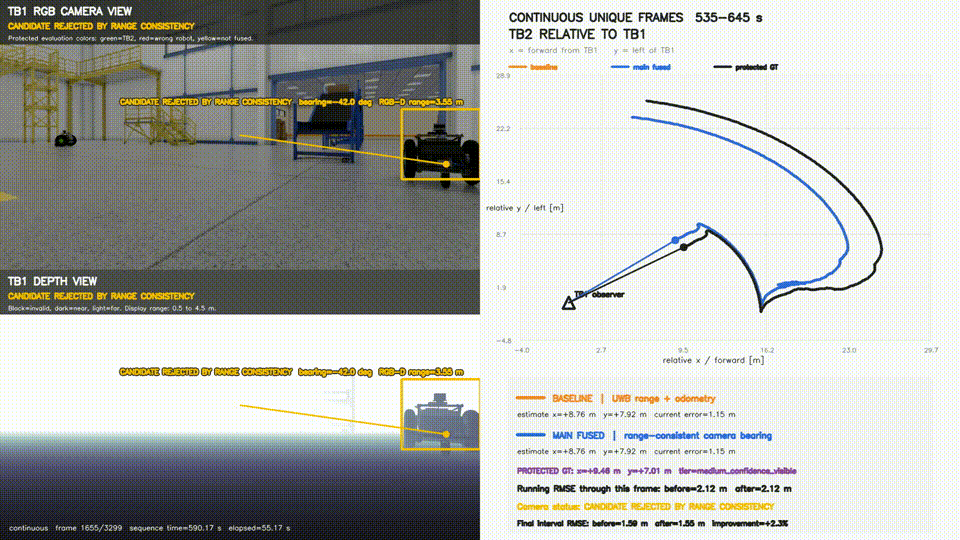

# RGB-D and UWB relative-pose fusion

An executable, notebook-based demonstration of RGB-D proposals, UWB range-consistency association, and particle filtering with both robots' odometry. Algorithm code is kept directly in the notebook so it can be read and edited alongside the plots.

## Experiment preview

The animation below shows the second half of the continuous RGB-D/UWB trajectory visualization at 3× playback speed, where the most informative trajectory changes occur. It combines camera views, depth, accepted visual events, UWB/odometry baseline, fused estimate, and protected ground truth for evaluation.

<p align="center">
  
</p>

Full 3× MP4 preview: [continuous_trajectory_rgbd_with_gt_3x.mp4](docs/media/continuous_trajectory_rgbd_with_gt_3x.mp4)

## Quick start

Python 3.11 or newer is recommended. From this repository directory:

```bash
python3 -m venv .venv
source .venv/bin/activate
python -m pip install -r requirements.txt
python run_notebook.py
```

This runs the complete sample notebook and checks proposal counts, relative-motion transforms, finite estimates, and independence from ground-truth input columns. The executed notebook is written to the Git-ignored `outputs/` directory.

To edit interactively:

```bash
jupyter lab notebooks/02_rgbd_uwb_particle_fusion.ipynb
```

For Colab, upload the complete directory to `MyDrive/rgbd-uwb-fusion`, open the notebook, and run all cells. The setup cell mounts Drive and installs dependencies. A notebook opened directly from GitHub still needs the repository's sample files in the runtime. Adjust the setup path if necessary.

## What runs

1. Decode 12 RGB-D pairs and generate green-structure proposals, using median depth, intrinsics, and a 0.44 m surface-to-center offset.
2. Inspect precomputed tracked camera events in a separate, aligned 100-row fusion excerpt (about 10 seconds at 10 Hz).
3. Gate available events at a maximum absolute range residual of 1 m and camera/UWB skew of 20 ms.
4. Propagate relative-pose particles using both odometry increments, update range using UWB, and update bearing using accepted camera events.
5. Evaluate estimated positions against the protected ground truth.

**Scope:** the image proposals and fusion inputs are two demonstration stages. The 12 new proposal sets are not tracked and fed directly into the filter. The fusion CSV already contains camera events accepted by the original full-run tracking/association pipeline; reapplying its gate here does not reproduce the original rejected-event statistics. The initial state is a saved UWB/odometry baseline estimate at the snippet start; full bootstrap is not rerun.

The compact filter uses reduced sampling, local particle initialization, and notebook noise/resampling settings. It is not a bit-for-bit reproduction of the original full-sequence filter. Full-run tracking, bootstrap, and 110-second evaluation require the original experiment pipeline and data, which are separate project artifacts.

## Expected sample results

- Proposal counts: `[1, 1, 2, 1, 1, 2, 2, 2, 2, 1, 2, 1]`.
- Seed: `7`; particles: `2500`.
- Sample baseline position RMSE: approximately `1.111 m`.
- Sample bearing-assisted position RMSE: approximately `0.344 m`.

The printed full-run RMSE values (`1.590 m` baseline, `1.553 m` main) are historical report references, not values recomputed by this sample. Numerical results can vary slightly by dependency version; see `VALIDATION.md` for the tested environment.

## Data contract and provenance

`snippets/phase2_fusion/` contains:

| Input | Contents |
| --- | --- |
| `rgbd_manifest.csv` | Bag timestamp in nanoseconds, image paths, episode name, archived proposal count |
| `rgb/*.jpg` | Original JPEG payloads; do not recompress when comparing proposal counts |
| `depth/*.png` | Registered single-channel depth in millimetres, zero = invalid |
| `fusion_timeseries.csv` | Timestamp, both planar odometry poses, nearest UWB measurement and skew, optional precomputed camera events, protected truth |
| `initial_state.json` | Baseline relative position/yaw at snippet start; derived without protected truth |

Coordinates use forward `x`, left `y`; lengths are metres, odometry/relative yaw is radians, camera bearing is degrees. Image coordinates use rightward `u` and downward `v`. `camera_uwb_residual_m` is signed RGB-D minus UWB range. The `gt_*` columns are read only for evaluation, not to generate candidates or update particles. A smoke check repeats filtering with those columns removed.

The data comes from the derived `CSE_warehouse_r1_r2_legacy_ros2` experiment and `full_sequence_patch_experiment` outputs. RGB-D examples cover 577.3–577.8 s and 602.0–602.5 s; aligned fusion rows cover approximately 601.4–611.3 s. The derived dataset includes generated odometry/UWB streams; these should not be presented as fresh physical sensor recordings. Original bags and full trajectories are not included.

To adapt the example, replace image and time-series files, camera calibration, color thresholds, and robot offset. Supply chronologically ordered odometry and independently tracked camera events. Keep ground truth for evaluation only. Unlabeled filtering can omit `gt_*` and skip the final evaluation cell.

## Repository layout

```text
notebooks/       # canonical algorithm code and explanatory cells
snippets/        # portable sample inputs
run_notebook.py  # execution plus regression checks
requirements.txt
VALIDATION.md
```
